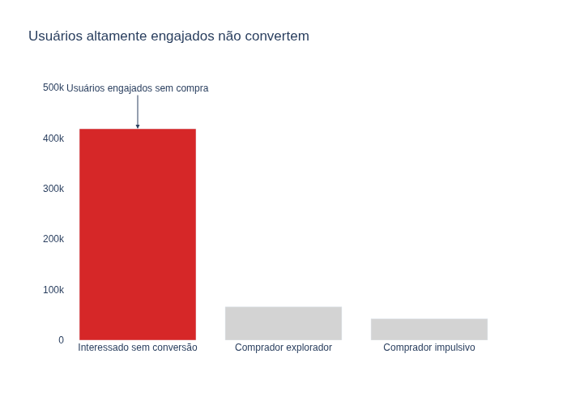
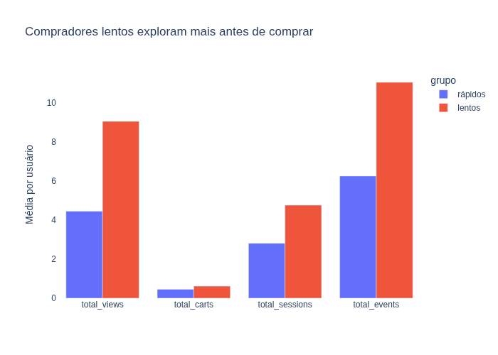
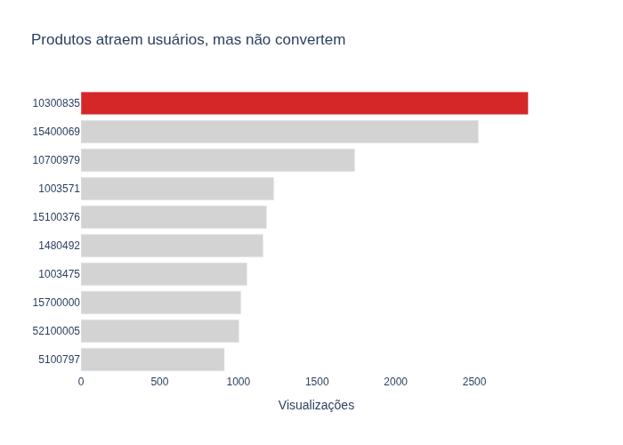

# Behavioral Product Analytics

## Why Highly Engaged Users Do Not Convert

Behavioral analysis of e-commerce users focused on understanding why many users browse products, return to the platform, but do not complete purchases.

This project investigates user behavior patterns, exploratory shopping journeys, conversion friction and decision-making behavior using transactional event data.

---

# Business Problem

Most users interact with products but never convert.

The main question explored in this analysis was:

> Are users leaving because they are not interested, or because something interrupts the purchase decision process?

---

# Dataset

The dataset contains user interaction events from an e-commerce platform, including:

- product views
- cart additions
- purchases
- session behavior
- timestamps
- product categories
- prices

Main columns used:

- `event_time`
- `event_type`
- `user_id`
- `user_session`
- `product_id`
- `category_code`
- `price`

---

# Main Analysis Steps

The analysis was divided into:

1. Funnel behavior exploration
2. Time-to-purchase analysis
3. Fast vs exploratory buyers
4. Behavioral segmentation
5. High-interest low-conversion products
6. User exploration patterns

---

# Key Insights

## Highly engaged users do not necessarily convert

Users without purchases showed:

- more sessions
- more product views
- more exploratory behavior

This suggests that the problem may not be user acquisition, but converting interest into purchase decisions.

---

## Half of purchases happen quickly

The median purchase time was relatively low, indicating many purchases happen shortly after the first interaction.

However, a long-tail distribution revealed that some users take significantly longer before purchasing.

This suggests two different behavioral patterns:

- impulsive buyers
- exploratory buyers

---

## Complex product categories generate exploratory behavior

Users without conversion concentrated their navigation in categories such as:

- smartphones
- notebooks
- electronics

These categories usually involve:

- comparison behavior
- price research
- technical evaluation
- multiple visits before purchase

---

## Products attract users but fail to convert

Some products received high numbers of views but extremely low conversion rates.

Possible explanations include:

- pricing perception
- lack of trust
- insufficient product information
- comparison friction
- weak purchase confidence

---

# Visualizations

## Users highly engaged but not converting



---

## Half of purchases happen quickly



---

## Products attract users but fail to convert



---

# Technologies Used

- Python
- Pandas
- Plotly
- Jupyter Notebook
- Git & GitHub

---

# Project Structure

```bash
behavioral-product-analytics/
│
├── notebooks/
├── output/charts/
├── src/
├── README.md
├── requirements.txt
└── .gitignore